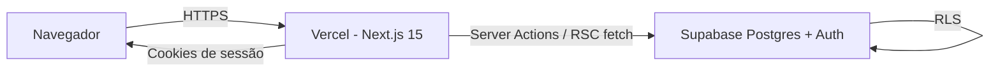
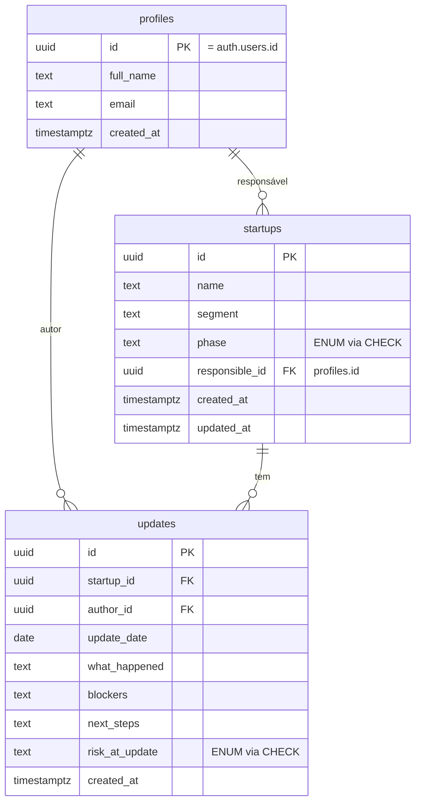
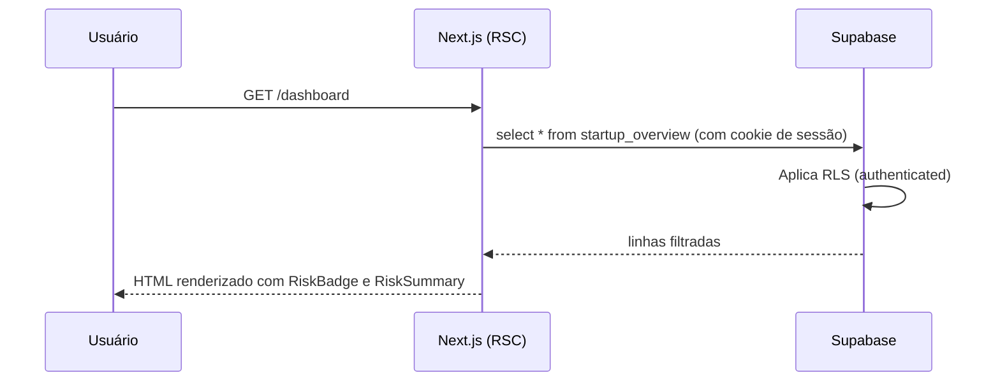
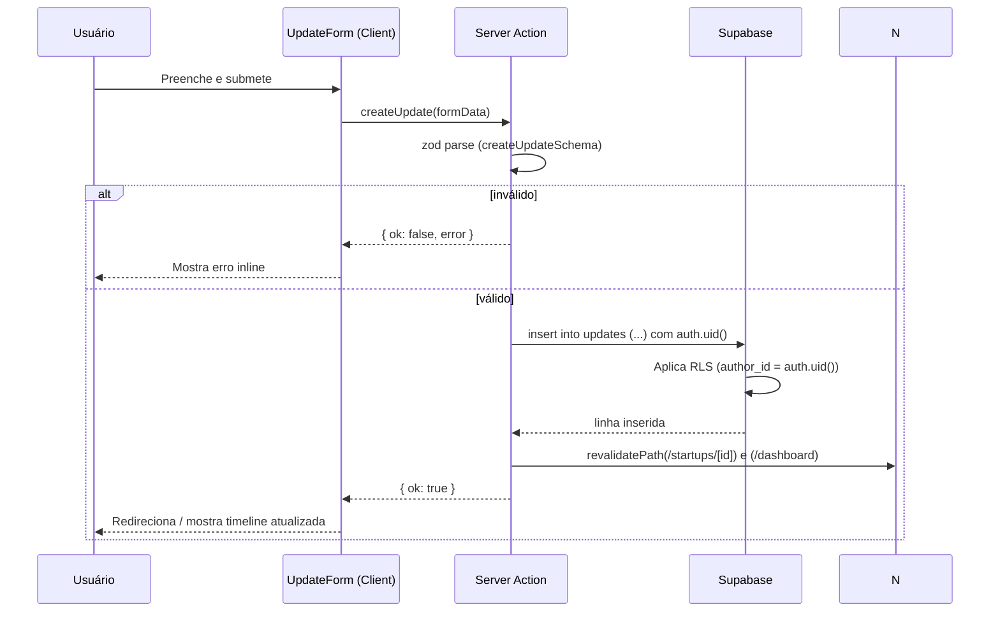

# Arquitetura — Bluefields MVP

## 1. Visão geral

Aplicação fullstack monorepo único, com frontend e backend acoplados via **Next.js 15 (App Router)**. Persistência e autenticação delegadas ao **Supabase**. Deploy em **Vercel**.



A app não tem servidor próprio: tudo o que precisa de banco roda em **React Server Components** ou em **Server Actions**, ambos do lado do servidor da Vercel, autenticando contra o Supabase via cookies.

## 2. Decisões técnicas e por quês

### 2.1. Por que Next.js 15 (App Router)

- Framework fullstack pronto, sem precisar de backend separado.
- **Server Actions** reduzem boilerplate de API e mantêm validação no servidor.
- **React Server Components** permitem carregar dados direto do Supabase sem expor cliente HTTP.
- Deploy nativo na Vercel.

### 2.2. Por que Supabase

- Postgres real, não um BaaS opaco.
- Auth funcional pronto (email/senha, magic link, OAuth) com cookies HTTP-only.
- **Row Level Security (RLS)** força a segurança no banco, não só na app.
- CLI gera tipos TypeScript do schema, alinhando frontend e banco.

### 2.3. Por que sem ORM

- O domínio é pequeno (3 tabelas + 1 view).
- O cliente Supabase já oferece query builder tipado quando combinado com tipos gerados.
- ORM seria peso extra para um MVP de 6–10h.

### 2.4. Por que Server Actions e não API REST

- Forms postam direto para a função do servidor; sem rota intermediária.
- Validação `zod` roda do mesmo lado da escrita no banco.
- Menos código, menos surface area para bugs.
- Caso futuro precise de API pública, transformamos em route handlers depois.

### 2.5. Por que shadcn/ui + Tailwind

- shadcn copia componentes para dentro do repositório (não é dependência fechada).
- Tailwind centraliza tokens visuais; combina com a regra de "sem literais soltos".
- Dá visual decente sem custo de design.

## 3. Modelagem de dados

### 3.1. Tabelas



Notas:
- `profiles.id` é **igual** a `auth.users.id` (FK para `auth.users` com `on delete cascade`). Trigger no Supabase preenche `profiles` quando um usuário é criado.
- `phase` e `risk_at_update` usam `CHECK constraint` com lista fechada (mais simples que `CREATE TYPE` para o MVP, mais fácil de migrar).
- **A tabela `startups` não tem coluna `risk_level`.** O risco é derivado.

### 3.2. View `startup_overview` (risco derivado do último update)

```sql
create or replace view startup_overview as
select
  s.id,
  s.name,
  s.segment,
  s.phase,
  s.responsible_id,
  p.full_name as responsible_name,
  s.created_at,
  s.updated_at,
  latest.risk_at_update as current_risk,
  latest.update_date    as last_update_date,
  latest.id             as last_update_id
from startups s
left join profiles p on p.id = s.responsible_id
left join lateral (
  select u.id, u.risk_at_update, u.update_date
  from updates u
  where u.startup_id = s.id
  order by u.update_date desc, u.created_at desc
  limit 1
) latest on true;
```

- **Single source of truth** para risco: nunca há divergência entre "risco da startup" e "risco do último update".
- Quando não há nenhum update, `current_risk` vem `null` (é tratado na UI como "sem informação").

### 3.3. Row Level Security (RLS)

Política do MVP: **qualquer usuário autenticado pode ler tudo; qualquer autenticado pode inserir; só o autor (ou o responsável) pode editar/excluir o próprio recurso**.

| Tabela | SELECT | INSERT | UPDATE | DELETE |
|---|---|---|---|---|
| profiles | `auth.role() = 'authenticated'` | trigger (não direto) | `id = auth.uid()` | bloqueado |
| startups | `auth.role() = 'authenticated'` | `auth.role() = 'authenticated'` | `auth.role() = 'authenticated'` | `auth.role() = 'authenticated'` |
| updates  | `auth.role() = 'authenticated'` | `author_id = auth.uid()` | `author_id = auth.uid()` | `author_id = auth.uid()` |

- Para o MVP, qualquer membro pode editar qualquer startup (são poucos usuários, todos do time interno). Documentado como trade-off no PRD.
- **Updates** já implementam autoria: só o autor pode mexer no próprio update.
- A view `startup_overview` herda RLS das tabelas-base via `security_invoker = true`.

## 4. Fluxo de dados

### 4.1. Leitura (dashboard)



### 4.2. Escrita (novo update)



## 5. Estrutura de pastas

```
bluefields-vagas/
├── docs/
│   ├── PRD.md
│   ├── AI-PLAN.md
│   ├── ARCHITECTURE.md
│   ├── QUALITY-REVIEW-SKILL.md
│   └── REVIEW.md
├── supabase/
│   ├── migrations/0001_init.sql
│   └── seed.sql
├── src/
│   ├── app/
│   │   ├── (auth)/login/page.tsx
│   │   ├── (app)/
│   │   │   ├── layout.tsx
│   │   │   ├── dashboard/page.tsx
│   │   │   ├── startups/page.tsx
│   │   │   ├── startups/new/page.tsx
│   │   │   ├── startups/[id]/page.tsx
│   │   │   └── startups/[id]/edit/page.tsx
│   │   ├── layout.tsx
│   │   └── page.tsx (redireciona)
│   ├── components/
│   │   ├── ui/             # shadcn
│   │   ├── dashboard/
│   │   ├── startups/
│   │   ├── updates/
│   │   └── layout/
│   ├── lib/
│   │   ├── supabase/{client,server,middleware}.ts
│   │   ├── constants/
│   │   ├── validations/
│   │   └── utils/
│   ├── server/
│   │   └── actions/{startups,updates,auth}.ts
│   ├── types/db.ts        # gerado por supabase CLI
│   └── middleware.ts
├── tests/
├── .env.example
├── next.config.ts
├── tailwind.config.ts
├── package.json
└── README.md
```

## 6. Camadas e responsabilidades

| Camada | Localização | Responsabilidade |
|---|---|---|
| Apresentação (RSC) | `src/app/(app)/*/page.tsx` | Buscar dados, montar a página, delegar UI a componentes |
| Componentes | `src/components/<dominio>` | UI reutilizável, sem lógica de negócio |
| Server Actions | `src/server/actions/*.ts` | Validar com zod, persistir, revalidar paths |
| Validações | `src/lib/validations/*.ts` | Schemas zod compartilhados entre form e action |
| Constantes | `src/lib/constants/*.ts` | Enums de domínio, rotas, tokens visuais |
| Acesso ao Supabase | `src/lib/supabase/*.ts` | Criar clientes server/client/middleware |
| Tipos | `src/types/db.ts` | Tipos gerados do schema |
| Banco | `supabase/migrations/*.sql` | Schema + RLS + view |

**Regra dura:** páginas (`page.tsx`) não criam blocos de UI no lugar — delegam a componentes em `src/components/`. Componentes não conversam com Supabase diretamente — recebem dados via props ou disparam Server Actions.

## 7. Constantes e tokens (cumprindo `general_rules.mdc`)

- `src/lib/constants/risk-levels.ts` — `RISK_LEVEL = { GREEN, YELLOW, RED }` + lista ordenada + labels em PT-BR.
- `src/lib/constants/startup-phases.ts` — `STARTUP_PHASE = { IDEATION, MVP, TRACTION, SCALE }` + labels.
- `src/lib/constants/routes.ts` — todas as rotas internas como constantes.
- `src/lib/constants/ui-tokens.ts` — classes Tailwind por risco (badge, anel), labels e ícones.
- `src/lib/constants/api.ts` — paginação, limites de input, durações.

Toda comparação de status no código é feita contra essas constantes (`x === RISK_LEVEL.RED`, nunca `x === 'red'`).

## 8. Validação e tratamento de erros

- **Schemas zod** em `src/lib/validations` são a única fonte de verdade para shape de input.
- Server Actions retornam **sempre** `{ ok: true, data } | { ok: false, error: string, fieldErrors? }`.
- Erros do Supabase são mapeados para mensagens em PT-BR antes de subir para o cliente.
- Forms usam `react-hook-form` com `@hookform/resolvers/zod` para validação client-side e mostram erros por campo.

## 9. Segurança

| Vetor | Mitigação |
|---|---|
| Acesso anônimo ao banco | RLS em todas as tabelas + service role nunca no cliente |
| Vazamento de chave service | Apenas no servidor (env vars privadas), nunca em código que roda no client |
| CSRF em Server Actions | Next.js já protege com Origin check; cookies HTTP-only |
| Injeção de SQL | Cliente Supabase parametriza; nunca concatenar strings em query |
| XSS | React escapa por padrão; nada de `dangerouslySetInnerHTML` |
| Senhas fracas | Política de força mínima do Supabase Auth + mensagem clara |
| Dados em logs | Server Actions não logam payloads completos (apenas IDs e tipos de erro) |

## 10. Observabilidade (mínima)

- Logs do Next.js / Vercel para erros de Server Action.
- Console no servidor com `console.error` em catch de Server Action (sem PII).
- Próximo passo (registrado em REVIEW): integrar Sentry e logs estruturados.

## 11. Testes

- **Unitários (vitest)**, mínimos e estratégicos:
  - Validators zod (`createStartup`, `createUpdate`).
  - Função utilitária `getRiskOrder` (usada para ordenar/agregar risco).
  - Função utilitária `getRiskTone` que mapeia `RISK_LEVEL` para token visual — garante que renomear um valor quebra os testes.
- **Sem E2E** neste MVP. Débito consciente registrado em `REVIEW.md`.

## 12. Performance e custo

- **Server Components** evitam JS desnecessário no cliente.
- **`revalidatePath`** depois de mutações; nada de `staleTime` complexo.
- Supabase free tier suficiente para o volume do MVP (dezenas de startups, dezenas de updates).
- Sem cache externo; se virar produção real, considerar Edge cache do Next.

## 13. Variáveis de ambiente

```
NEXT_PUBLIC_SUPABASE_URL=...
NEXT_PUBLIC_SUPABASE_ANON_KEY=...
SUPABASE_SERVICE_ROLE_KEY=...   # somente em ambientes server (jamais ao client)
```

`.env.example` versionado; `.env.local` no `.gitignore`. Vercel recebe as variáveis pelo painel.

## 14. Limitações conhecidas (link com REVIEW)

- Sem convites/roles.
- Sem auditoria de alterações.
- Sem testes E2E.
- Sem soft delete (delete é permanente).
- Sem paginação (lista cresce até alguns milhares de linhas sem problema, mas é débito).

Cada um dos itens acima reaparece em `REVIEW.md` como débito assumido.
