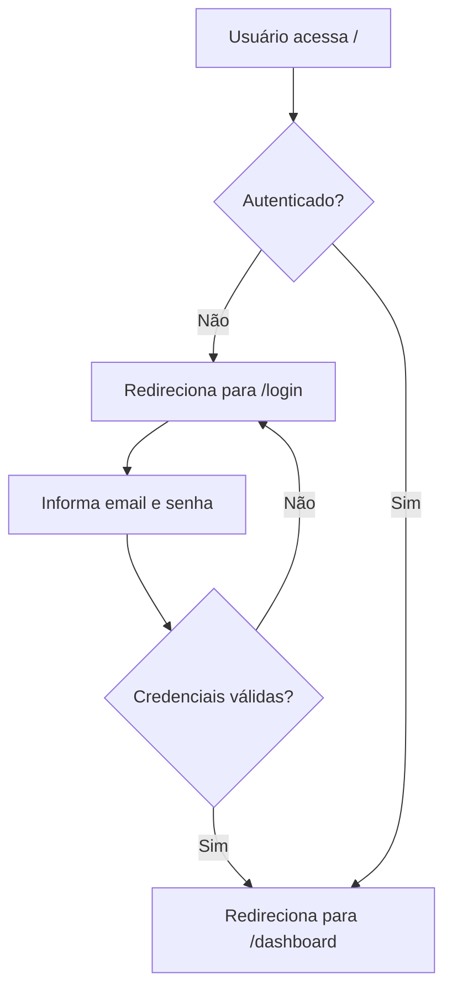
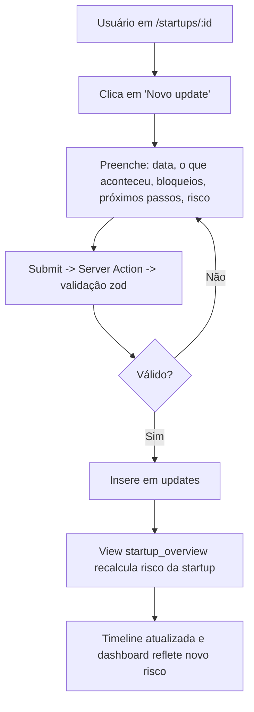
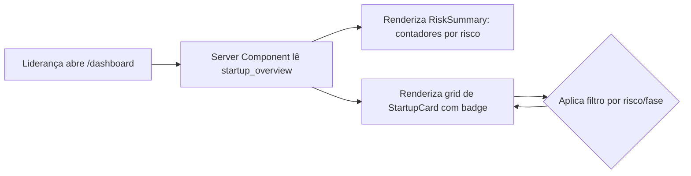

# PRD — Bluefields Acompanhamento de Startups

> Versão: 1.0 — MVP do desafio técnico
> Autor: candidato (Cursor como ferramenta de IA)
> Data: 2026-05-01

## 1. Problema

A Bluefields é uma aceleradora que acompanha dezenas de startups em paralelo. Hoje, o acompanhamento dessas startups é fragmentado:

- Atualizações de progresso chegam por WhatsApp, e-mail e em reuniões presenciais.
- Documentos importantes ficam em Notion, Google Drive ou na cabeça das pessoas.
- Não há um lugar único onde o time consiga ver, de forma consolidada, o status de cada startup, quais estão em risco e quais precisam de atenção prioritária.

A consequência prática é que o time perde tempo buscando informação que deveria estar disponível e, às vezes, só percebe que uma startup está em dificuldade tarde demais.

> **Pergunta-guia:** como o time da Bluefields pode ter, em um único lugar, uma visão clara e atualizada do progresso, dos riscos e dos próximos passos de cada startup acelerada — sem depender de mensagens dispersas e reuniões não documentadas?

## 2. Contexto e oportunidade

- **Quem opera hoje:** o time interno da Bluefields (responsáveis por carteira de startups + lideranças que precisam visão consolidada).
- **Quem perde com o problema:** as próprias startups aceleradas, que recebem atenção tardia.
- **Por que agora:** com o crescimento do portfólio, o custo de manter informação distribuída cresce de forma não linear. Centralizar mesmo que de forma simples já gera ganho operacional imediato.
- **Concorrência interna:** Notion, planilhas e WhatsApp. O MVP não precisa ser melhor que essas ferramentas em tudo — precisa ser **suficientemente bom no recorte específico de "status semanal + risco + próximos passos"** para que o time prefira usá-lo nesse contexto.

## 3. Persona

### 3.1. Persona primária — Responsável de carteira Bluefields

- **Quem é:** profissional do time Bluefields que acompanha N startups simultaneamente.
- **Onde sente a dor:** quando precisa preparar reunião de portfólio, responder uma liderança ou priorizar onde gastar tempo na semana.
- **O que precisa:**
  - Registrar rapidamente o que aconteceu com cada startup na semana.
  - Sinalizar bloqueios e próximos passos sem ter que escrever um relatório longo.
  - Saber onde estão os pontos de atenção, sem reler 50 conversas de WhatsApp.

### 3.2. Persona secundária — Liderança Bluefields

- **Quem é:** sócio ou líder do time de aceleração.
- **O que precisa:** abrir a aplicação e em menos de 30 segundos saber **quais startups estão vermelhas/amarelas e por quê**.

## 4. Jobs to be done (JTBD)

| ID | Quando... | Eu quero... | Para que... |
|---|---|---|---|
| JTBD-1 | termino uma reunião com a startup | registrar em poucos minutos o update da semana (o que aconteceu, bloqueios, próximos passos, risco) | a informação não se perca em mensagens e eu não precise relembrar depois |
| JTBD-2 | abro o sistema na segunda de manhã | ver de imediato quais startups estão em risco/atenção | conseguir priorizar onde vou alocar minha semana |
| JTBD-3 | preciso responder uma pergunta de liderança sobre uma startup | ver o histórico recente daquela startup em ordem cronológica | dar uma resposta consistente sem reabrir threads dispersas |
| JTBD-4 | adiciono uma nova startup ao portfólio | cadastrar nome, segmento, fase e responsável rapidamente | passar a acompanhá-la no mesmo lugar das outras |
| JTBD-5 | sou liderança e quero olhar o portfólio inteiro | ver um painel consolidado com semáforo e contagens por risco | identificar tendências sem ter que abrir cada startup |

## 5. Escopo do MVP

### 5.1. In-scope (precisa estar no MVP)

1. **Autenticação funcional** — apenas usuários autenticados acessam a aplicação (Supabase Auth, e-mail + senha).
2. **Cadastro e visualização de startups** com pelo menos: nome, segmento, fase, responsável Bluefields.
3. **Registro de updates periódicos** por startup, contendo:
   - Data do update.
   - O que aconteceu.
   - Bloqueios.
   - Próximos passos.
   - Nível de risco no momento (verde / amarelo / vermelho).
4. **Indicador de risco/atenção por startup**, derivado do **último update** registrado (single source of truth).
5. **Dashboard consolidado** com:
   - Total de startups por risco (contadores verde/amarelo/vermelho).
   - Lista/cards de startups com badge de risco e fase.
   - Filtro simples por risco e por fase.
6. **Página de detalhe da startup** com timeline de updates em ordem cronológica decrescente.
7. **Persistência real** em Postgres (Supabase).
8. **Deploy público** na Vercel acessível via link.

### 5.2. Out-of-scope (explicitamente fora)

- Design elaborado / UI polida (foco em legibilidade e clareza, não estética).
- Integrações com WhatsApp, Slack ou ferramentas externas.
- IA embutida no produto (a IA é usada **no processo de desenvolvimento**, não dentro da aplicação).
- Sistema de notificações e e-mails.
- Export para CSV/PDF.
- Convites de usuário, gestão de roles, multi-tenant.
- Auditoria e logs avançados.
- Mobile-first / app nativo (responsivo simples é suficiente).

### 5.3. Extras incluídos com justificativa

- **Filtro por risco e por fase no dashboard:** custo baixo, valor alto para JTBD-2 e JTBD-5 (priorizar onde olhar). Sem ele, o dashboard vira só uma lista, e a persona secundária não é bem servida.
- **Risco derivado do último update:** evita inconsistência entre "risco da startup" e "risco do último update". Custo: uma view SQL. Benefício: nunca há drift entre os dois valores.

## 6. Fluxos principais

### 6.1. Fluxo de login

### 6.2. Fluxo de novo update

### 6.3. Fluxo do dashboard

## 7. Critérios de sucesso

### 7.1. Critérios de aceite (binário, MVP)

- [ ] Usuário não autenticado é bloqueado em qualquer rota `(app)/*`.
- [ ] Usuário autenticado consegue criar, listar, editar e excluir uma startup.
- [ ] Usuário autenticado consegue registrar um update em uma startup existente.
- [ ] A timeline de updates da startup é exibida em ordem cronológica decrescente.
- [ ] O risco exibido no card da startup no dashboard é igual ao risco do **último update** registrado.
- [ ] O dashboard mostra contadores agregados por risco (verde/amarelo/vermelho).
- [ ] Filtros do dashboard funcionam combinados (risco + fase).
- [ ] Aplicação está pública na Vercel com Supabase em produção.
- [ ] Banco impede acesso anônimo (RLS habilitada em todas as tabelas).

### 7.2. Métricas de produto (se virasse produto real)

- **Tempo médio para registrar um update:** alvo < 90s. Métrica norteadora — se demorar mais, o time volta para o WhatsApp.
- **% de startups do portfólio com update na última semana:** alvo > 80%. Se cair, o produto perdeu adoção.
- **Tempo médio até identificar uma startup em risco:** medido como `now() - max(updates.created_at) where risk = RED`. Mais é pior.
- **Stickiness (DAU/WAU do time interno):** mede se o time abre o painel rotineiramente, não só na reunião de carteira.

## 8. Trade-offs assumidos

| Trade-off | Decisão | Por quê |
|---|---|---|
| Roles e permissões granulares vs. todos autenticados podem tudo | Escolhi "todos autenticados podem tudo" no MVP | Time Bluefields é pequeno e coeso; complexidade extra não é prioritária para validar valor |
| Risco como campo manual na startup vs. derivado do último update | Derivado do último update | Evita drift entre dois lugares de verdade. Custo: uma view |
| UI com biblioteca pronta vs. design system próprio | shadcn/ui + Tailwind | MVP precisa parecer profissional sem custo de design |
| API REST formal vs. Server Actions | Server Actions | Reduz boilerplate, mantém validação no servidor com zod, alinhado a Next.js 15 |
| Testes E2E (Playwright) vs. apenas unitários críticos | Apenas unitários nos validators e na regra de derivação de risco | Tempo limitado de 6–10h; cobertura E2E é débito consciente registrado em REVIEW.md |
| ORM (Prisma/Drizzle) vs. cliente Supabase direto | Cliente Supabase direto + tipos gerados | Menos camada para um MVP; tipos vêm do Supabase CLI; ORM seria overhead |
| Email/senha vs. magic link / OAuth | Email + senha | Não depende de infra de e-mail funcional para a demo; UX simples |

## 9. Não-objetivos explícitos

Para evitar escopo escondido, o MVP **não tenta**:

- Substituir o Notion como base de conhecimento.
- Substituir o WhatsApp como canal de conversa em tempo real.
- Avaliar automaticamente o desempenho da startup com IA.
- Sincronizar dados com sistemas externos.

## 10. Próximos passos pós-MVP (se houvesse v2)

- Convites de membros + roles (admin, membro).
- Anexos em updates (links do Notion/Drive ou upload).
- Histórico de risco em série temporal (gráfico).
- Notificação semanal "startups sem update há mais de N dias".
- IA opcional para gerar resumo executivo do portfólio a partir dos updates da semana.

## 11. Glossário

- **Startup acelerada:** empresa do portfólio Bluefields que está sendo acompanhada.
- **Update:** registro periódico (tipicamente semanal) sobre o estado de uma startup.
- **Risco:** classificação verde/amarelo/vermelho indicando quanta atenção a startup precisa receber agora.
- **Responsável Bluefields:** membro do time interno que conduz o relacionamento com aquela startup.
